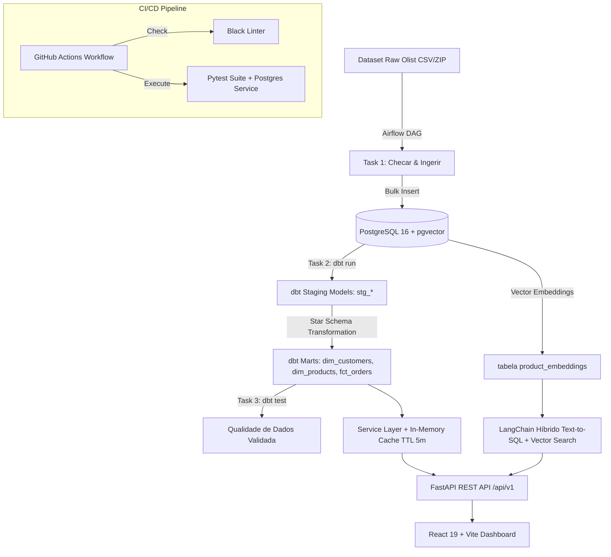

# 📊 Enterprise Business Intelligence, Data Engineering & AI Platform (Olist E-Commerce)

[](https://www.python.org/)
[](https://fastapi.tiangolo.com/)
[](https://react.dev/)
[](https://www.typescriptlang.org/)
[](https://www.getdbt.com/)
[](https://airflow.apache.org/)
[](https://www.docker.com/)
[](https://github.com/pgvector/pgvector)
[](https://github.com/features/actions)

Plataforma profissional de **Engenharia de Dados, Business Intelligence e Inteligência Artificial**, projetada para o ecossistema de e-commerce brasileiro com base no dataset real da **Olist** (+448 mil registros).

O sistema implementa as melhores práticas de mercado: **Data Transformation com dbt (Star Schema)**, **Orquestração com Apache Airflow**, **Conteinerização Completa com Docker Compose**, **Busca Semântica Híbrida via pgvector + LangChain**, **API RESTful assíncrona com FastAPI**, **Dashboard React 19 em Dark Mode** e **Esteira CI/CD automatizada com GitHub Actions**.

---

## 🌟 Os 5 Pilares de Maturidade Técnica

### 1. 🔶 Transformação de Dados & Modelagem Dimensional com dbt
- **Arquitetura Medallion**: Dados brutos na camada Bronze (`public`), visões higienizadas em Staging Prata (`stg_customers`, `stg_orders`, `stg_order_items`, `stg_order_payments`, `stg_products`) e modelo **Star Schema** na camada Gold (`dim_customers`, `dim_products`, `fct_orders`).
- **Data Quality Contracts (`schema.yml`)**: Testes automáticos validando integridade referencial (`relationships`), unicidade (`unique`) e obrigatoriedade (`not_null`).

### 2. 🐳 Conteinerização Enterprise com Docker Compose
- **Orquestração Única (`docker compose up`)**:
  - `db`: PostgreSQL 16 com a extensão **`pgvector`** pré-instalada (`ankane/pgvector`).
  - `backend`: API REST FastAPI com suporte a conexões assíncronas e fallback DB.
  - `frontend`: Dashboard SPA React 19 + Vite servido via Nginx otimizado.
  - `airflow`: Servidor e Scheduler do Apache Airflow rodando dags integradas.

### 3. 🌀 Orquestração de Pipelines com Apache Airflow
- **DAG Automatizada (`dag_pipeline_olist.py`)**:
  1. `task_checar_arquivos`: Valida presença de CSVs brutos em `data/raw`.
  2. `task_ingestao_raw`: Ingestão bulk via script Python na camada Bronze.
  3. `task_dbt_run`: Construção das dimensões e fatos via dbt.
  4. `task_dbt_test`: Execução dos testes de qualidade de dados.

### 4. 🧠 AI Híbrida: Text-to-SQL + Busca Semântica (`pgvector` + LangChain)
- **Engine Vetorial**: Armazenamento de embeddings de 1536 dimensões na tabela `product_embeddings`.
- **Consultas Híbridas**: LangChain LCEL combinando geração de SQL dinâmico (Text-to-SQL via Groq Llama-3.3-70b) e busca por similaridade de cosseno (`ORDER BY embedding <=> :vector`).

### 5. ⚙️ Esteira CI/CD Automatizada com GitHub Actions
- **Workflow em `.github/workflows/ci.yml`**: Executa a cada `push` ou `pull_request` na branch `main`:
  - Linter e checagem de formatação Python com `black --check`.
  - Subida automática de container de banco PostgreSQL `pgvector`.
  - Execução completa da suíte de testes unitários e de integração com `pytest`.

---

## 🏗️ Arquitetura do Sistema



---

## 📊 Schema Dimensional (Data Warehouse - Star Schema)

```
             ┌─────────────────────────┐
             │      dim_customers      │
             ├─────────────────────────┤
             │ PK  customer_id         │
             │     customer_unique_id  │
             │     city, state         │
             │     total_orders        │
             └────────────┬────────────┘
                          │ 1
                          │
                          │ N
             ┌────────────┴────────────┐
             │       fct_orders        │
             ├─────────────────────────┤
             │ PK  order_id            │
             │ FK  customer_id         │
             │     purchase_timestamp  │
             │     total_items_price   │
             │     total_freight_value │
             │     total_order_value   │
             │     total_payment_value │
             └────────────┬────────────┘
                          │ N
                          │
                          │ 1
             ┌────────────┴────────────┐
             │      dim_products       │
             ├─────────────────────────┤
             │ PK  product_id          │
             │     category_name       │
             │     weight_g, dimensions│
             │     total_items_sold    │
             │     total_revenue       │
             └─────────────────────────┘
```

---

## 🖥️ Módulos do Dashboard Interativo (React 19)

1. **📈 Visão Executiva**: KPIs em tempo real (Receita Total, Pedidos, Clientes Únicos, Ticket Médio) com gráficos temporais.
2. **📦 Análise de Produtos**: Ranking de produtos por faturamento e distribuição multi-cor por categoria.
3. **🗺️ Clientes & Geografia**: Distribuição geográfica por UF do Brasil e métodos de pagamento.
4. **🤖 Assistente IA (Text-to-SQL + Vetorial)**: Interface de chat com transparência total (exibe SQL gerado e dados brutos).

---

## 🚀 Como Executar o Projeto Localmente

### Opção A: Execução Conteinerizada Única (Recomendada)
Para subir todos os serviços (PostgreSQL 16 com `pgvector`, FastAPI Backend, Frontend React e Apache Airflow):

```bash
# Clone o repositório
git clone https://github.com/augdev1/business_intelligence.git
cd business_intelligence

# Suba a infraestrutura completa
docker compose up --build -d
```

#### Acessos aos Serviços Conteinerizados:
- 📍 **Dashboard React**: [http://localhost:3000](http://localhost:3000)
- 📍 **API FastAPI (Swagger)**: [http://localhost:8000/docs](http://localhost:8000/docs)
- 📍 **Apache Airflow Webserver**: [http://localhost:8080](http://localhost:8080) *(User: `admin` | Pass: `admin`)*

---

### Opção B: Execução Manual / Desenvolvedor

#### 1. Iniciar Banco PostgreSQL com pgvector
```bash
docker run -d --name vendas_db -p 5432:5432 -e POSTGRES_USER=vendas_user -e POSTGRES_PASSWORD=vendas_password -e POSTGRES_DB=vendas_db ankane/pgvector:v0.8.0
```

#### 2. Povoar Camada Raw e Executar dbt
```bash
# Povoar banco relacional
python scripts/carregar_sqlite_rapido.py

# Executar transformações e testes dbt
cd dbt_olist
dbt run --profiles-dir .
dbt test --profiles-dir .
cd ..
```

#### 3. Gerar Embeddings Vetoriais
```bash
python -m ai.embed_products
```

#### 4. Executar Testes & Checagem de Código
```bash
black --check .
python -m pytest -v
```

---

## 📌 Estrutura Completa do Repositório

```
business_intelligence/
├── .github/
│   └── workflows/
│       └── ci.yml                     # Esteira CI/CD (Linter Black + Pytest)
├── ai/
│   ├── embed_products.py              # Pipeline de geração de embeddings vetoriais pgvector
│   ├── prompts.py                     # Prompts do LangChain
│   └── sql_chain.py                   # Chain Híbrida Text-to-SQL + Busca Semântica
├── backend/
│   ├── api/
│   │   ├── main.py                    # API FastAPI com CORS e suporte DB
│   │   └── routes/                    # Endpoints REST (/kpi, /ia)
│   ├── models/                        # Modelos SQLAlchemy (Customer, Order, Product, ProductEmbedding)
│   ├── repositories/                  # Repository Pattern (Acesso a dados)
│   └── services/                      # Camada de Serviços com In-Memory Cache (2.9ms TTL)
├── dags/
│   └── dag_pipeline_olist.py          # DAG Airflow: Checagem -> Bronze -> dbt run -> dbt test
├── data/
│   └── raw/                           # CSVs do Olist E-Commerce
├── database/
│   └── connection.py                  # Conexão PostgreSQL com fallback SQLite + Índices SQL
├── dbt_olist/                         # Projeto dbt (Data Build Tool)
│   ├── dbt_project.yml                # Configuração do dbt
│   ├── profiles.yml                   # Conexão PostgreSQL via variáveis de ambiente
│   └── models/
│       ├── schema.yml                 # Testes automáticos (unique, not_null, relationships)
│       ├── staging/                   # Camada Silver / Staging (stg_*)
│       └── marts/                     # Camada Gold / Marts (dim_customers, dim_products, fct_orders)
├── docker/
│   ├── Dockerfile.backend             # Container FastAPI / Python
│   ├── Dockerfile.frontend            # Container React 19 + Nginx
│   └── init_pgvector.sql              # Script SQL para ativação do pgvector
├── frontend-react/                    # Dashboard React 19 + Vite + Tailwind v4 + Recharts
├── scripts/
│   └── carregar_sqlite_rapido.py      # Script de ingestão bulk na camada Bronze
├── tests/                             # Suíte de testes unitários e de integração
├── docker-compose.yml                 # Orquestração completa de 4 serviços
├── pyproject.toml                     # Configuração de ferramentas Python (Black, Pytest)
├── requirements.txt                   # Dependências Python do projeto
└── README.md                          # Documentação técnica do repositório
```

---

## 📄 Licença

Distribuído sob a licença **MIT**. Veja `LICENSE` para mais informações.

---

<p align="center">
  <b>Desenvolvido com Python, dbt, Apache Airflow, PostgreSQL pgvector, FastAPI, React 19 & LangChain</b>
</p>
